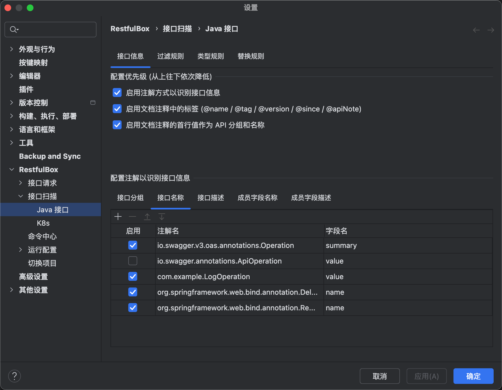
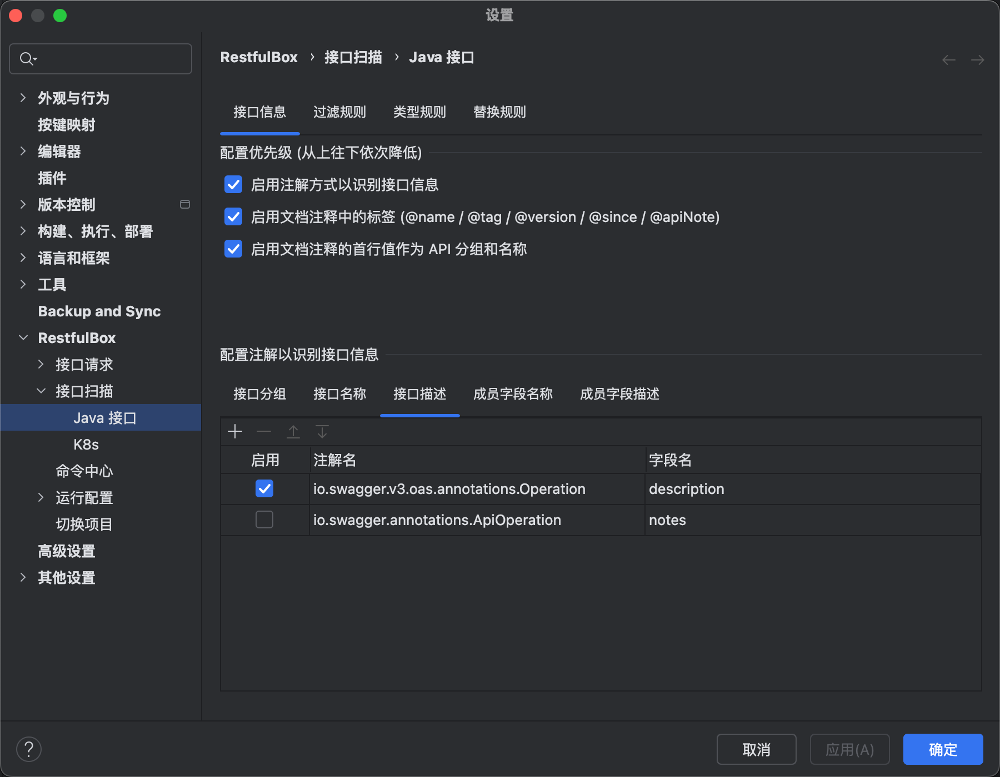
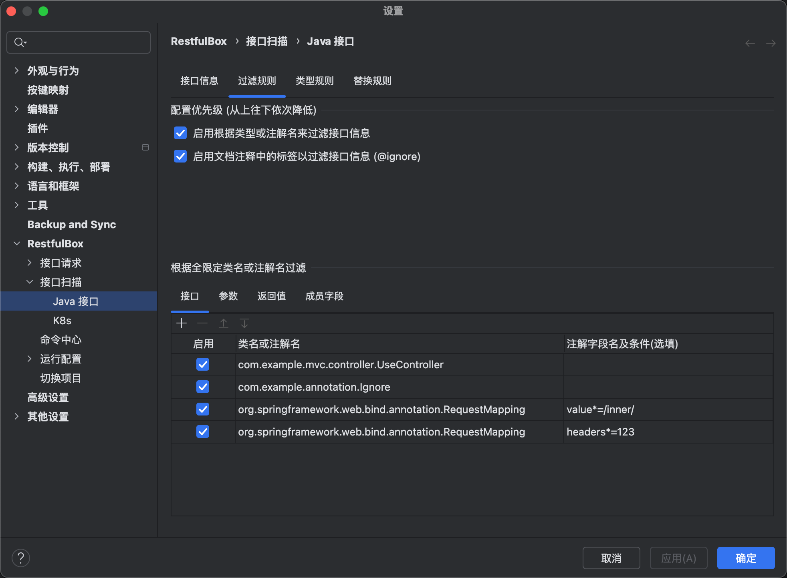
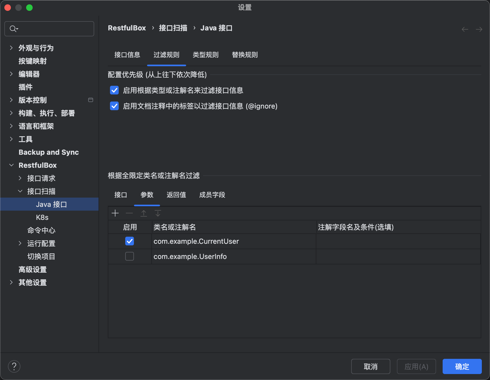
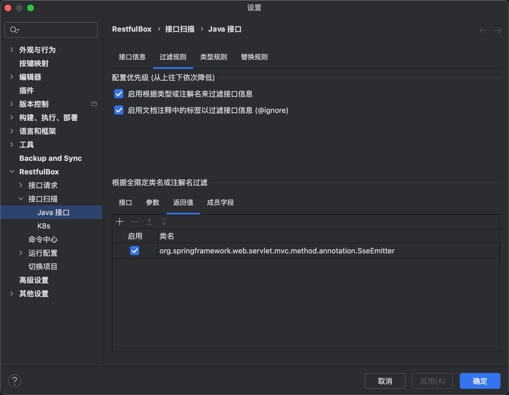
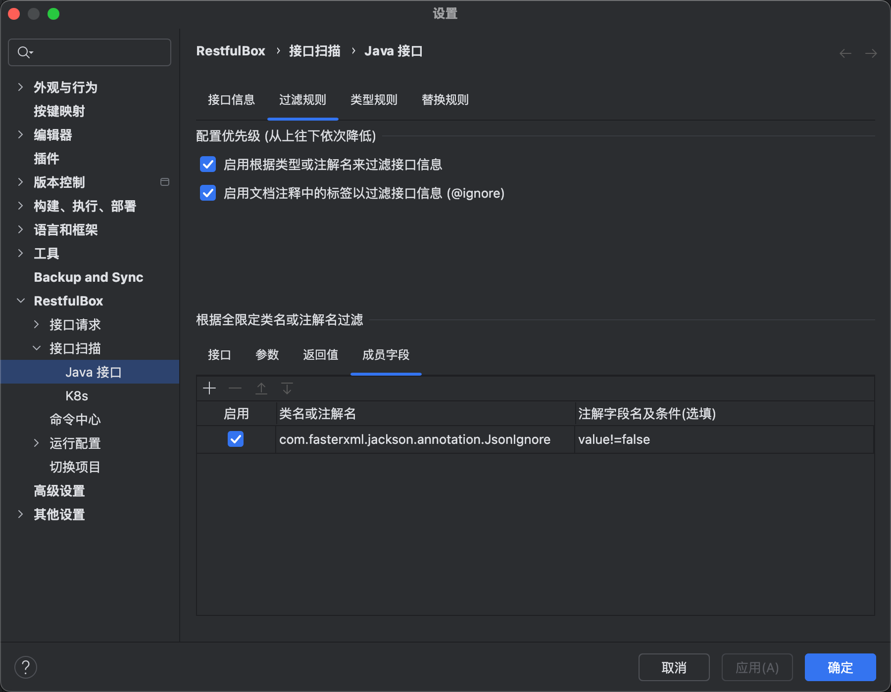
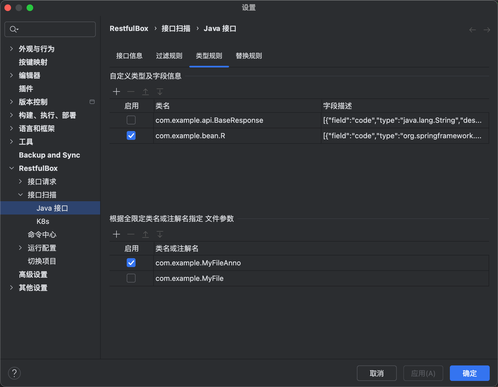
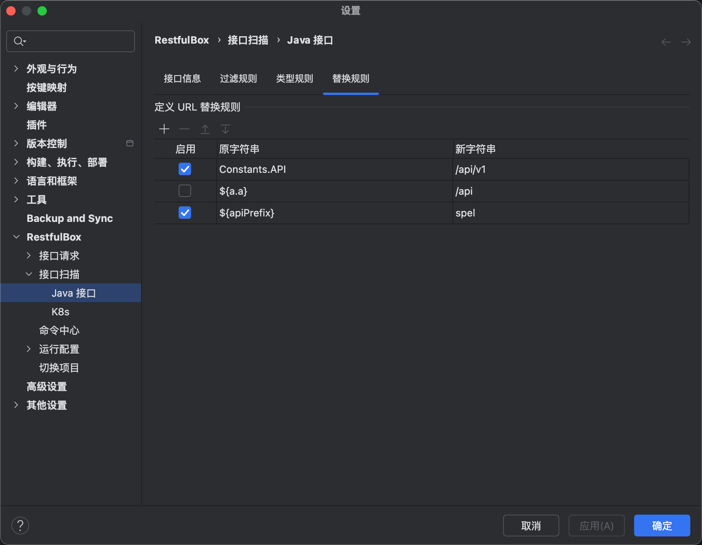

# Java 扫描接口配置

## 一、概述
- Java、Kotlin等实现的接口均为Java扫描接口，符合本文规则描述
- 分为：接口信息、过滤规则、类型规则、替换规则

## 二、接口信息

用于定义如何识别接口分组、名称、描述、参数中涉及成员字段的名称及描述

优先级: `注解` > `文档注释标签` > `文档注释首行值` > `代码本身类型或名称`

注解配置规则：在表格上填写**注解名**和**注解字段名**，勾选启用。

### 接口分组

_优先级从高到低_

1. 类注解，识别配置的注解
2. 类文档注释标签：`@name`
3. 类文档注释第一行，要求不为空
4. 类全限定名


- 示例

在接口信息中配置 `@io.swagger.v3.oas.annotations.tags.Tag`, `name` 字段

```java
/**
 * 用户接口
 *
 * @name 接口分组名称
 */
@io.swagger.v3.oas.annotations.tags.Tag(name = "用户接口") //优先级最高
public class UserController {
}
```

### 接口名称

_优先级从高到低_

1. 方法注解，识别配置的注解
2. 方法文档注释中的自定义tag`@name`
3. 方法文档注释第一行，要求不为空
4. 方法名



- 示例

在接口信息中配置 `@com.example.LogOperation`, `value` 字段

```java
/**
 * 测试方法
 *
 * @name 接口名称
 */
@com.example.LogOperation("优先级最高的接口名称") //优先级最高
public R<Map<String, User>> test();
```

### 接口描述

_优先级从高到低_

1. 方法注解，识别配置的注解
2. 方法文档注释中的tag `@apiNote xxx`
3. 方法文档注释描述部分
4. 留空



- 示例

在接口信息中配置 `@io.swagger.v3.oas.annotations.Operation`, `description` 字段

```java
/**
 * 这里可能会作为描述，对于第3点
 *
 * @apiNote 接口描述
 */
@io.swagger.v3.oas.annotations.Operation(description = "一些描述") // 优先级最高
public R<Map<String, User>> test();
```

### 成员字段名称

_优先级从高到低_

1. 字段注解，识别配置的注解
2. 字段本身名称


- 示例

在接口信息中配置 `@com.fasterxml.jackson.annotation.JsonProperty`, `value` 字段

```java
@Data
public class User {
    /**
     * 添加时间
     */
    @com.fasterxml.jackson.annotation.JsonProperty("create_time")
    private LocalDateTime createTime;

    /**
     * 用户名，没配置不生效
     */
    @com.alibaba.fastjson.annotation.JSONField(name = "user_name")
    private String username;
}
```

### 成员字段描述

_优先级从高到低_

1. 字段注解，识别配置的注解
2. 字段文档注释描述部分
3. 留空


- 示例

在接口信息中配置 `@io.swagger.v3.oas.annotations.media.Schema`, `description` 字段

```java
@Data
public class UserInfo {
    /**
     * 描述
     */
    @io.swagger.v3.oas.annotations.media.Schema(description = "主键") // 优先级最高
    private String id;
}
```

### 接口入参

_从`6.2.0`支持, 已适配 SpringMVC, 支持映射RequestBody参数_

1. 在方法文档注释中存在tag`@param`，则会尝试解析 `@param` 的值作为类型，如下示例
2. 参数本身的返回类型

`@param`示例，如`com.example.bean.ListQuery`支持以下两种格式（Kotlin请使用**格式2**）：

- 示例 格式1:

```java
/**
 * param中解析参数类型
 *
 * @param user {@link ListQuery} 用户信息
 */
@RequestMapping(method = {RequestMethod.POST})
public R addUser(@RequestBody String user) {}
```

- 示例 格式2:

```java
/**
 * param中解析参数类型
 *
 * @param user @com.example.bean.ListQuery 用户信息
 */
@RequestMapping(method = {RequestMethod.POST})
public R addUser(@RequestBody String user) {}
```

### 接口返回值

1. 在方法文档注释中存在tag`@return`，则会尝试解析 `@return` 的值作为类型，如下示例
2. 方法本身的返回类型

`@return`示例，如`R<PageRespVo<User>>`支持以下两种格式（Kotlin请使用**格式2**）：

- 示例 格式1:

```java
/**
 * 从@return中解析返回类型
 *
 * @return {@link R<PageRespVo<User>>}
 */
public Object get(@PathVariable BigInteger docId);
```

- 示例 格式2:

```java
/**
 * 从@return中解析返回类型
 *
 * @return @com.example.bean.R#com.example.bean.PageRespVo#com.example.bean.User
 */
public Object get(@PathVariable BigInteger docId);
```

### 接口标签

1. 位于类文档注释中的自定义tag: `@tag`、`@version`、`@since`
2. 位于方法文档注释中的自定义tag: `@tag`、`@version`、`@since`

- 示例

```java
/**
 * 测试方法
 *
 * @tag v1, 自定义标签
 * @since 1.0.3
 */
```

## 三、过滤规则

用于定义如何过滤接口、参数、返回值、参数中的成员字段

优先级: `类名或注解名` > `文档注释标签`

类名和注解名配置规则：
- 在表格上填写**类名或注解名**，勾选启用则生效
- 若按类名过滤，则只需填写全路径类名，支持 `*` 匹配包下所有类（如: `org.springdoc.webmvc.ui.*`）；
- 当填写注解时，**注解字段名可选填**。**未填写则以包含该注解进行过滤**，填写条件如下：
  - 等值匹配(`key=value`): 从注解中取出的key字段值必须等于该value, 非默认值
  - 不相等匹配(`key!=value`): 从注解中取出的key字段值必须不等于该value, 非默认值
  - 模糊匹配(`key*=value`): 从注解中取出的key字段值必须包含该value, 非默认值, 区分大小写

### 过滤接口

_优先级从高到低_

1. 按类名称、类注解、方法注解过滤
2. 类、方法的文档注释存在`@ignore`时，忽略对应的接口



- 示例1

```java
/**
 * 过滤接口配置类名com.example.UseController, 优先级最高
 *
 * @ignore 标签过滤次之
 */
public class UseController {}

/**
 * 过滤整个类
 * 过滤接口配置注解com.example.annotation.Ignore, 优先级最高
 */
@com.example.annotation.Ignore
public class UseController2 {

    /**
     * 单独过滤方法
     * @ignore
     */
    @com.example.annotation.Ignore
    @GetMapping(name = "获取用户列表")
    public R<List<User>> selectList() {}
}
```

- 示例2

```java
/**
 * 过滤Spring中RequestMapping中路径包含inner的接口
 * 在过滤规则中配置: `org.springframework.web.bind.annotation.RequestMapping`, `value*=/inner/`
 */
@RestController
@RequestMapping(name = "Spring注解识别name", value = "/api/v1/inner/user")
public class UseAnnotationNameController {}
```

### 过滤参数

1. 按参数的类名称、包含注解过滤



- 示例

```java
/**
 * 过滤接口配置类名 com.example.CurrentUser 或注解名 com.example.CurrentUser
 */
@GetMapping(name = "获取用户列表")
public R<List<User>> selectList(@com.example.CurrentUser com.example.UserInfo userInfo) {}
```

### 过滤返回值

1. 按识别到的返回值类型过滤



- 示例

```java
/**
 * 过滤接口配置类名 org.springframework.web.servlet.mvc.method.annotation.SseEmitter
 */
@PostMapping("/SSE/connect")
public SseEmitter handle(@RequestBody SSEConnectRequest sseConnectRequest) {}
```

### 过滤参数中的成员字段

_优先级从高到低_

1. 成员字段修饰词包含`static`或`transient`
2. 按类成员字段的类型名或注解过滤
3. 成员字段的文档注释存在`@ignore`时, 忽略解析



- 示例

```java
/**
 * 过滤接口配置成员字段类名 com.example.UserAge
 * 或注解名 com.fasterxml.jackson.annotation.JsonIgnore, 名称及条件为value!=false
 */
@Data
public class User {
    /**
     * 年龄信息
     * @ignore 优先级次之
     */
    @com.fasterxml.jackson.annotation.JsonIgnore
    private UserAge age;
}
```

## 四、类型规则

### 自定义类型及字段信息

通常用于为无法准确识别成员的类定义成员信息，可适用于入参和返回值，包括字段名、字段类型、描述信息，请参考示例填写。



- 示例

接口返回值是用的自定义类型 `com.example.bean.R`, 根据下列签名无法正常扫描出接口返回值包含的code、message、data等字段

```java
/**
 * 统一返回
 * code: 状态码
 * message: 异常信息
 * data: 业务数据
 */
@Data
public class R<T> extends HashMap<String, T> { }

/**
 * 一个接口
 */
@PostMapping(name = "获取用户信息")
public R<UserInfo> getUser(String id) {}
```

在自定义类型及字段信息配置该类型信息，类型填写`com.example.bean.R`, 字段描述填写：

```json
[
  {
    "field": "code",
    "type": "java.lang.String",
    "desc": "响应码"
  },
  {
    "field": "message",
    "type": "java.lang.String",
    "desc": "异常信息"
  },
  {
    "field": "data",
    "type": "",
    "desc": "业务内容，可根据泛型自动识别类型"
  }
]
```

重新扫描接口即可获得相应字段的信息。

### 定义文件参数

一般扫描框架内部会自动识别常用的文件类型，当未能识别为文件参数或存在自定义文件参数时，可以在此处进行设置。

规则为：指定文件参数类名或包含的注解名

- 示例

```java
/**
 * 自定义类型配置自定义文件参数 com.example.MyFile 或注解名 com.example.MyFileAnno
 */
@PostMapping(name = "上传文件")
public void uploadFile(@com.example.MyFileAnno com.example.MyFile file) {}
```

## 五、替换规则

### URL 替换规则

当扫描出来的接口包含未正常解析到的变量时，可配置替换规则，重新扫描

如: 接口扫出来的路径包含 `Constants.API`, 则配置后会自动替换为 `/api/v1`

