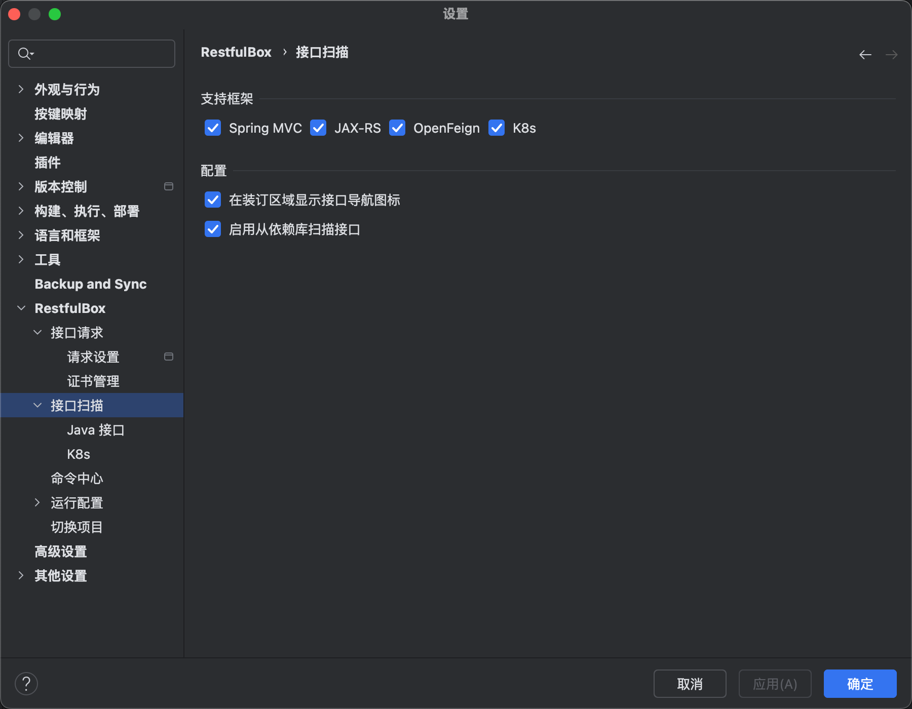
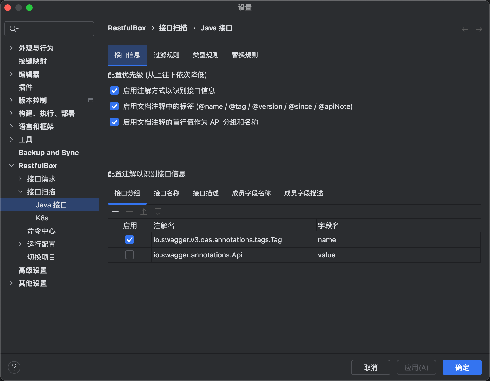
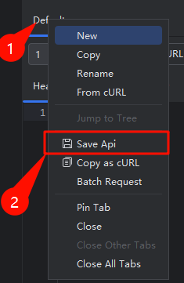
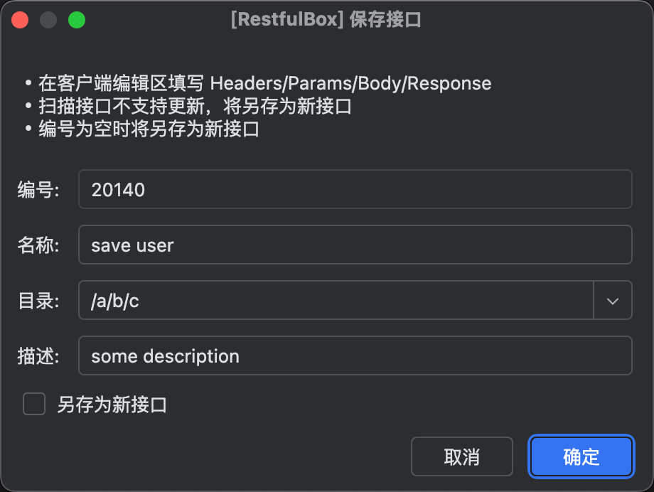
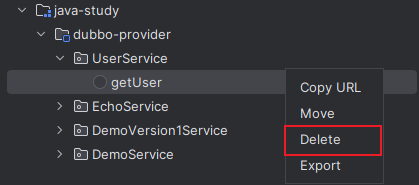

## 概述
API接口可分为多个类型：

- 按协议：HTTP 接口、dubbo 接口、k8s 自定义接口
- 按存储方式;：扫描获取、从数据源获取（Sqlite、MySQL等）

以上两种类型通常结合起来使用，如支持扫描 springmvc 的 HTTP 接口。

## 设置
如图显示支持的扫描类型，勾选即启用。

## 展示
点击 toolbar 的刷新按钮，将展示接口。

## 同步API
将接口列表一键同步到指定的数据源。

## 添加和更新

在选中 Request Client Tab 右键，点击【Save Api】。已存在 api 时会提示。操作完成后执行结果将更新到数据源。

- **Protocol**: 支持的协议，默认提供http。可扩展，如dubbo
- **ID**：接口ID，ID不存在时作新增操作，存在时作更新操作
- **Name**: 接口名
- **Folder**：API目录，类似文件系统路径，`/`分割。
- **Description**: 接口描述

## 删除

可删除存储类型的接口，不支持删除扫描类型的接口。在列表api上右键，删除。操作完成后执行结果将更新到数据源。

## 导入/导出

- 导出: 可导出**所有/按项目/按模块/按包名/多选/单个**，分别对应不同树节点右键菜单
- 导入: 在Toolbar点击导入按钮。操作完成后执行结果将更新到数据源。
