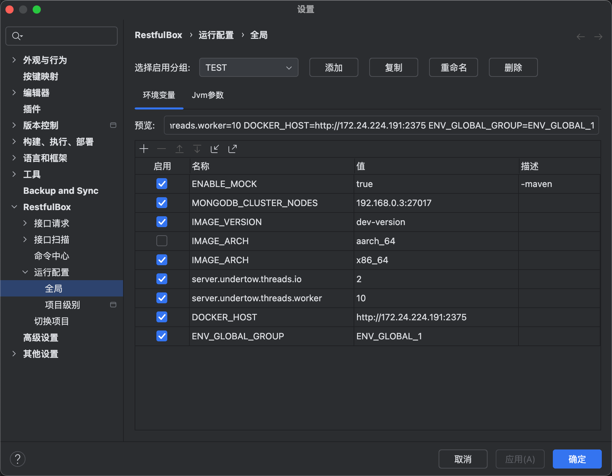
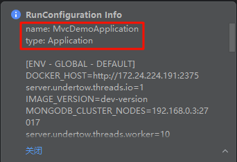
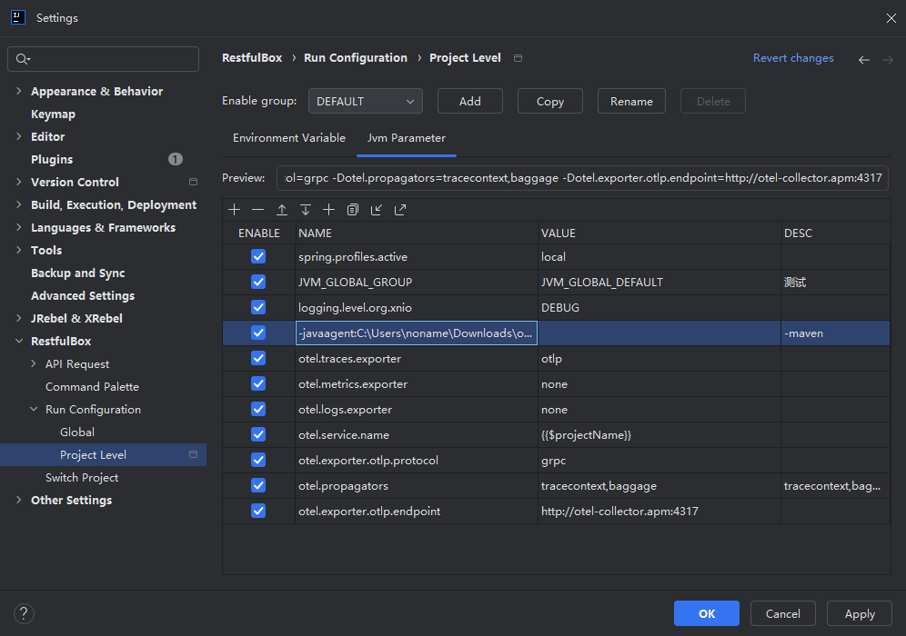

# 运行参数管理

## 概述

方便管理运行参数（包括Jvm），启动应用时，启用的环境变量和jvm参数将被自动设置到应用中。

## 功能

- 全局(跨项目)参数管理
- 项目级参数管理

## 配置

运行时打印信息

在设置中添加启动参数。

- 预览：预览启用的参数（鼠标Hover时可换行查看）
- 参数表格说明

| 列名     | 描述                              |
|--------|---------------------------------|
| ENABLE | 是否启用                            |
| NAME   | 参数key，不可为空                      |
| VALUE  | 参数value。为空时，生成的内容为NAME内容（jvm参数） |
| DESC   | 描述                              |

## 特殊规则

### VALUE支持的内置变量
- `{{$projectName}}`: 运行时会自动替换为当前项目名称

### 每个变量支持单独配置过滤规则

- 当前在 DESC 列通过前缀`-` 来使得在某些名称和类型的 RunConfiguration 中不生效。
- 格式为：`-aa,bb`。aa 和 bb为名称或类型，可为部分连续字符串，不能包含空格，名称和类型可通过开启【运行时打印信息】选项获取。如果想继续添加描述，可加空格及内容。
- 示例：某个变量在 maven 和 gradle 命令中不生效，可设置 DESC 为：`-maven,gradle 描述`。

## 其他

- 运行时环境变量支持 Golang 和 Java
- Jvm启动参数依赖Java插件，如IDEA/Android Studio